# RISC-V SoC with 4×4 Systolic-Array ML Accelerator

A from-scratch System-on-Chip in SystemVerilog: a 3-stage pipelined RV32I core
tightly coupled to a 4×4 INT8 systolic-array matrix-multiply accelerator over
an AXI4-Lite fabric. The core executes a small program that loads operand
matrices, kicks off the array, polls for completion, and reads results back —
all of it verified end-to-end in cocotb against a NumPy golden model.

```
                ┌──────────────────────────────────────────────────────┐
                │                       SoC                            │
                │                                                      │
                │   ┌────────────┐   AXI4-Lite   ┌──────────────────┐  │
                │   │  RISC-V    │◄────────────►│  Systolic Array  │  │
                │   │  RV32I     │              │   4×4 PE Grid    │  │
                │   │  (3-stage) │              │  INT8 × INT8 MAC │  │
                │   └─────┬──────┘              └────────┬─────────┘  │
                │         │                              │            │
                │         └──────────┬───────────────────┘            │
                │              ┌─────▼─────┐                           │
                │              │   SRAMs   │  Instr + Data             │
                │              └───────────┘                           │
                └──────────────────────────────────────────────────────┘
```

## Headline numbers

| Item | Value |
|------|-------|
| RTL lines (SystemVerilog) | ~2,500 |
| Cocotb tests passing | **44 / 44** across 11 suites |
| RV32I core, post-techmap cells (Yosys + ABC) | **8,398** |
| Accelerator + AXI4-Lite slave, post-techmap cells | **21,386** |
| Full SoC, flat post-techmap cells | **53,343** |
| Memory bits in SoC (16 KB I-SRAM + 16 KB D-SRAM) | 262,144 |
| Verilator lint | clean (no errors) |
| Random matmul checks (50 × 4×4 INT8 vs NumPy) | 50 / 50 PASS |
| Random RV32I instruction checks (8 progs × 31 regs) | 248 / 248 PASS |

## Repository layout

```
rtl/
├── core/           RV32I core: alu, regfile, imm_gen, decoder, fetch,
│                   hazard_unit, execute, load_align, riscv_core
├── accelerator/    sa_pkg, pe, sa_top (4×4 grid), sa_buffer (stagger FSM),
│                   accelerator_top (matmul behind AXI4-Lite slave)
├── axi/            axi4_lite_slave (CSR bank), mem_to_axil (master bridge)
├── memory/         sram (byte-strobed sync RAM)
└── soc_top.sv      Full integration: core + SRAMs + accelerator + routing

verif/
├── cocotb/
│   ├── core/       ALU, regfile, imm_gen, full-core integration tests
│   ├── accelerator/ PE unit, sa_buffer matmul, accelerator_top via AXI
│   ├── soc/        End-to-end SoC test (RV32I program drives accelerator)
│   └── common/     RV32I encoder, ALU/branch golden model, scoreboard,
│                   functional coverage helpers, AXI4-Lite master & monitor
└── assertions/     Procedural protocol checkers (AXI4-Lite, core invariants)

scripts/
├── run_tests.py        One-command regression runner (cocotb 2.x Python API)
├── coverage_report.py  Aggregates per-suite coverage into Markdown + HTML
├── synth_preproc.py    SV pre-processor for the Yosys built-in parser path
├── polish_comments.py  Banner-comment trim utility
└── open_waves.py       Launch GTKWave on a suite's wave dump

synth/
├── synth_core.ys, synth_accelerator.ys, synth_soc.ys   Yosys flows
└── build/              Generated stats + JSON netlists (gitignored)

docs/                   Architecture notes, per-phase implementation notes
```

## Verification

```
Suite                                       Tests
ALU                                          3/3
Regfile                                      5/5
Immediate generator                          6/6
RISC-V core integration                      8/8
PE                                           6/6
Systolic array buffer (matmul)               5/5      30 random matrices vs NumPy
AXI4-Lite slave (with protocol monitor)      4/4      live VALID-stickiness/payload-stability check
Accelerator top (matmul over AXI4-Lite)      3/3      10 random matmuls
SoC top (RV32I program drives accelerator)   2/2      assembled RV32I program end-to-end
RV32I core random instruction stream         1/1      8 progs × 31 regs = 248 checks vs Python interpreter
SoC random + functional coverage             1/1      50 constrained-random matmuls
─────────────────────────────────────────────────────
TOTAL                                       44/44     all green
```

Functional coverage from `cocotb_coverage` (last run):

```
top.matmul.a_sign       100.00%   (all_pos / all_neg / mixed / all_zero)
top.matmul.b_sign       100.00%
top.matmul.density      100.00%   (sparse / medium / dense non-zero counts)
top.matmul.max_abs       75.00%   (small / medium / large / max)
top.matmul.cross         66.67%   (sign × density)
─────────────────────────────────
SoC suite total          81.48%
```

## Waveforms

Running with `WAVES=1` produces `.fst` dumps under `sim/<suite>/`. Open them
with `python scripts/open_waves.py <suite>` (or `gtkwave sim/<suite>/<top>.fst`
directly). All screenshots below are GTKWave captures from real cocotb runs.

### RISC-V core (`riscv_core` suite)

Arithmetic + writeback (`addi`, `add`, `sub` chain) — `wb_we` pulses with
`wb_rd` cycling through x1..x4 and `wb_data` showing 5, 7, 12, 2:

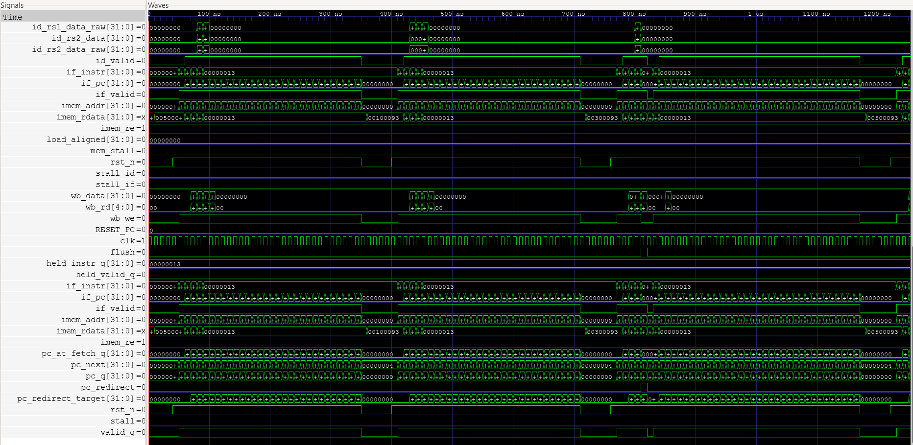

Branch taken — `flush=1`/`pc_redirect=1` pulse mid-frame redirects the PC,
flushing the IF/ID register:

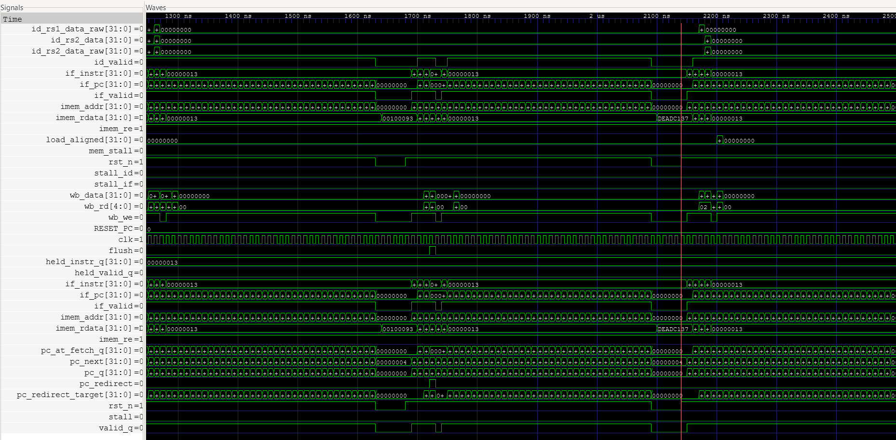

Load-use stall — `stall_id`/`stall_if` pulses on the cycle a `lw` is in EX
and the next instruction reads its destination. `imem_rdata=00002083` is
the `lw x1, 0(x0)` encoding:

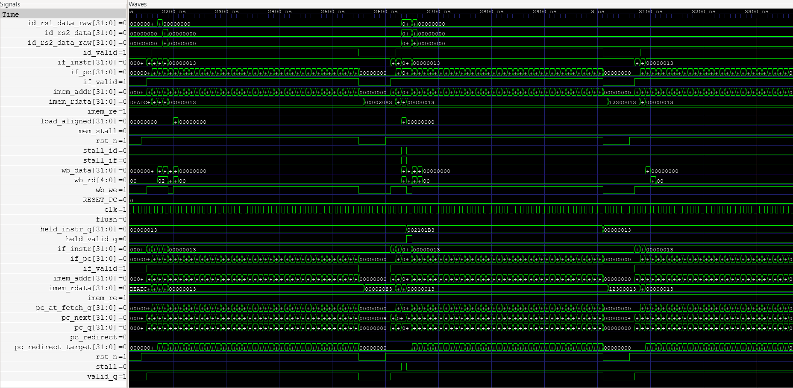

### Processing element (`pe` suite)

Random-storm MAC — `acc_out` and `acc_q` accumulating signed products as
`valid_in` pulses arrive each cycle with new `a_in × b_in`:

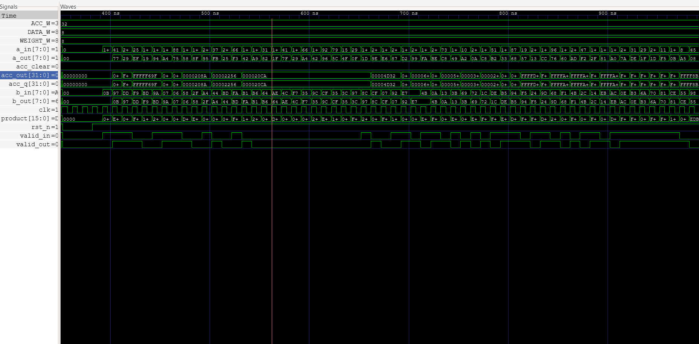
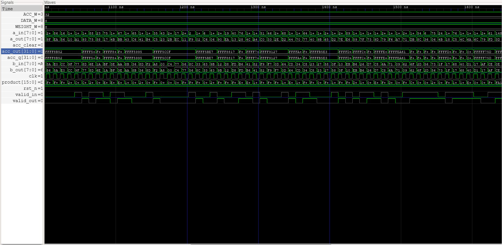

### 4×4 Systolic array (`sa_buffer` suite)

Five matrix-multiply runs back-to-back: `start` pulses, `busy` rises, `count`
ticks 0→11 (3N−1 cycles), `done` pulse, repeat. State machine cycles
`S_IDLE → S_RUN → S_LATCH → S_DONE`:

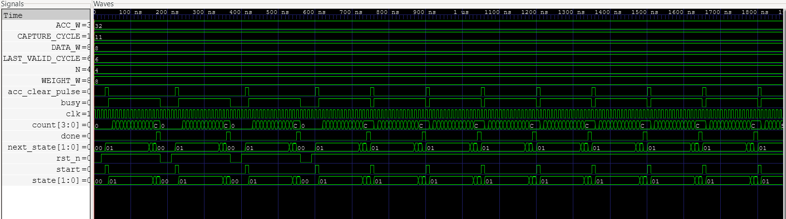

### AXI4-Lite slave (`axil` suite)

Write/read handshake test with byte-strobe — `awvalid+awready`, `wvalid+wready`,
`bvalid+bready` channels firing in sequence; `wstrb` shifting between `0xF`,
`0x2`, `0x8`:

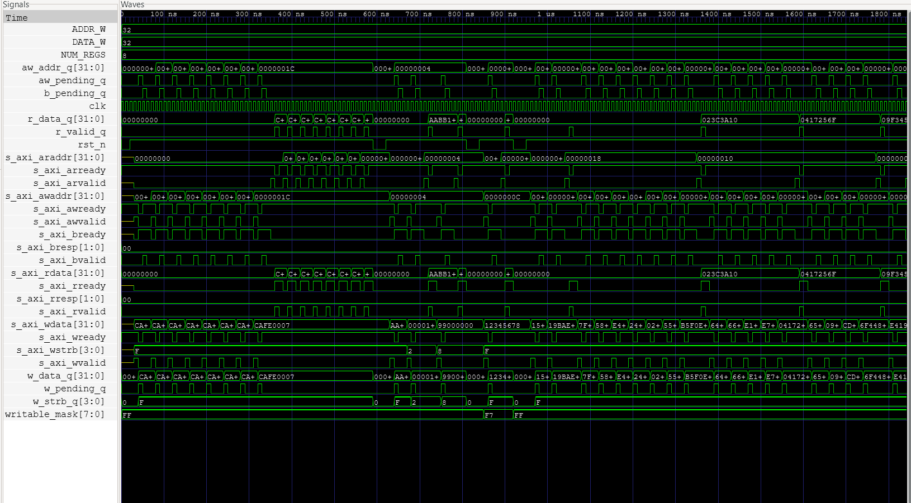

Random-storm test — 60 transactions, all returning `bresp=00` (OKAY):

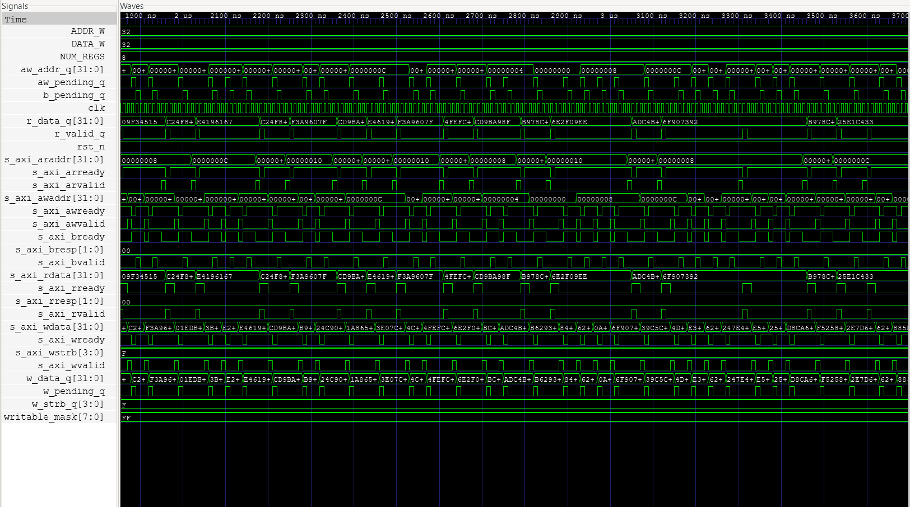

### Accelerator behind AXI4-Lite (`accel_top` suite)

Identity-matmul test — host writes A & B over the bus, `start_pulse` ticks,
`acc_busy` rises, `acc_done` pulses, then host reads C[0..15] back:

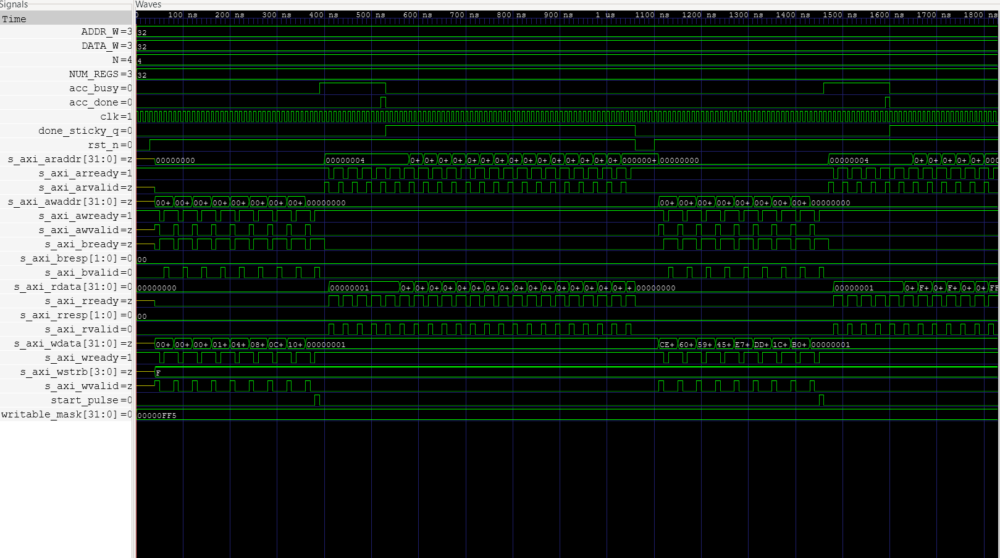
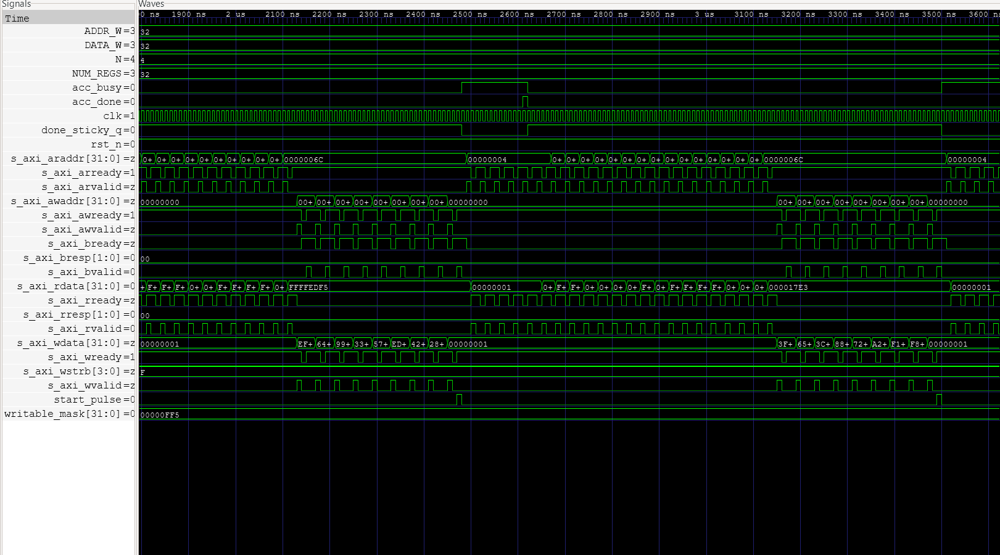

### Full SoC (`soc` suite) — end-to-end RV32I → systolic array

Wide view of the assembled program executing: bursts of MMIO traffic at
`0x2xxx_xxxx` (loads to accelerator + status polls + result reads), with
`bridge_stall` lifting the core's `core_dmem_stall` between transactions:

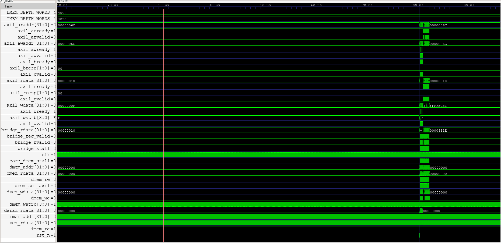

Zoomed in to a single matmul — the AXI bridge's `bvalid`/`rvalid` ticks,
`dmem_we` pulses (storing the 16 result words back to data SRAM), and
`bridge_rdata` returning the C[i][j] values from the accelerator:

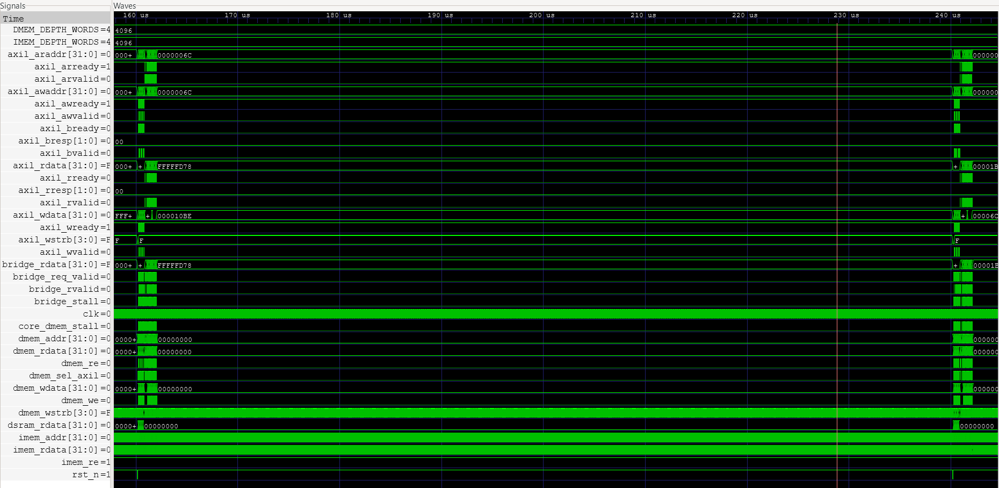

Random-test region — same shape repeated for each of the 5 random INT8
matrices, all verified against NumPy:

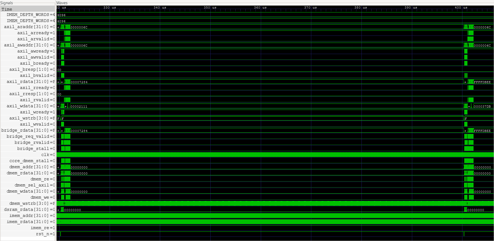

## Synthesis

Run with `yosys -m slang -s synth/synth_<target>.ys` (the slang frontend
ships in OSS CAD Suite). Reports land in `synth/build/<target>.stats`.

```
=== riscv_core (post-techmap, post-ABC) ===
   8,398 cells     1,335 flops    2,756 muxes    rest = combinational logic

=== accelerator_top (with AXI4-Lite slave) ===
  21,386 cells     1,633 flops    1,732 muxes    16× INT8 multipliers dominate

=== soc_top (flat) ===
  53,343 cells     3,950 flops    11,768 muxes   262,144 bits of memory
```

Caveats: Yosys' `abc -fast` plus the slang frontend gives a generic gate-level
mapping (no PDK), so absolute cell counts are best read as relative comparisons
between blocks. Mapping to sky130 / a real ASIC PDK is the natural next step.

## How to run it

```bash
# Activate the toolchain (OSS CAD Suite + cocotb 2.x)
source /c/oss-cad-suite/environment
export PATH="/c/Users/$USER/AppData/Roaming/Python/Python313/Scripts:$PATH"

# Full regression (~3 minutes)
python scripts/run_tests.py all

# A single suite
python scripts/run_tests.py soc

# With waveform capture
WAVES=1 python scripts/run_tests.py riscv_core sa_buffer accel_top soc

# Synthesis
mkdir -p synth/build
yosys -m slang -s synth/synth_core.ys
yosys -m slang -s synth/synth_accelerator.ys
yosys -m slang -s synth/synth_soc.ys -DSYNTHESIS

# Lint
verilator --lint-only --top-module soc_top -Wno-WIDTHEXPAND \
  rtl/core/*.sv rtl/memory/*.sv rtl/accelerator/*.sv rtl/axi/*.sv rtl/soc_top.sv

# Coverage report (Markdown + HTML)
python scripts/coverage_report.py
```

See [`docs/setup.md`](docs/setup.md) for first-time toolchain setup.

## Per-phase notes

* [Phase 1 — RV32I core](docs/phase1.md)
* [Phase 2 — 4×4 systolic array](docs/phase2.md)
* [Phase 3 — AXI4-Lite + SoC integration](docs/phase3.md)
* [Phase 4 — Verification environment](docs/phase4.md)

## Tech stack

| Category | Tool |
|----------|------|
| HDL | SystemVerilog (Verilog-2005 fallback for synth) |
| Simulator | Icarus Verilog (cocotb 2.x Python runner) |
| Verification | cocotb + cocotb_coverage |
| Lint | Verilator |
| Synthesis | Yosys (with `slang` SystemVerilog frontend) |
| Waveforms | GTKWave |
| Toolchain | OSS CAD Suite |

## Notes on UVM

The original project plan called for a UVM verification environment. UVM
requires a commercial simulator (VCS / Questa / Xcelium) and isn't usable on
free toolchains. The cocotb environment here delivers the same methodology —
constrained-random stimulus, a scoreboard with reference model, functional
coverage, protocol monitors — in Python. See
[`docs/phase4.md`](docs/phase4.md) for how each UVM concept maps.

## Author

Saksham Dhingra — final-year ECE.
